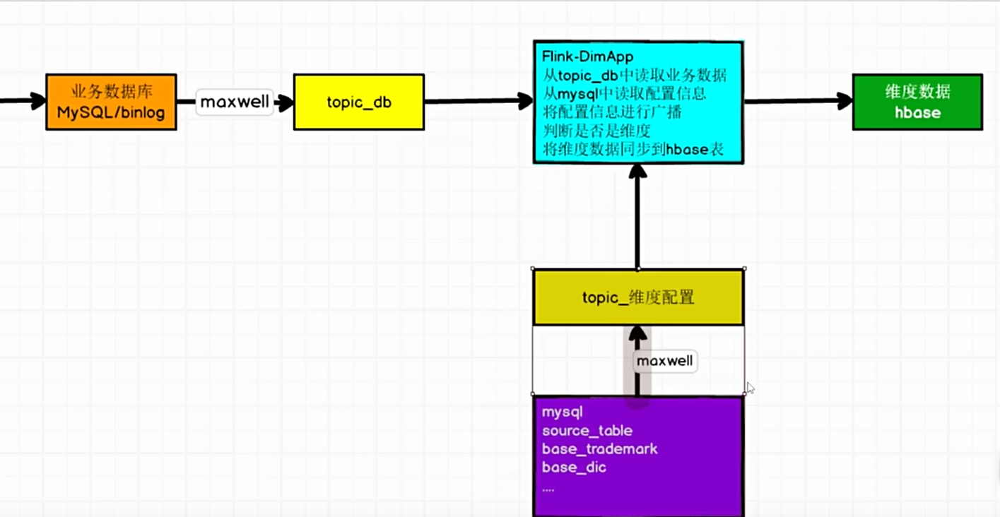
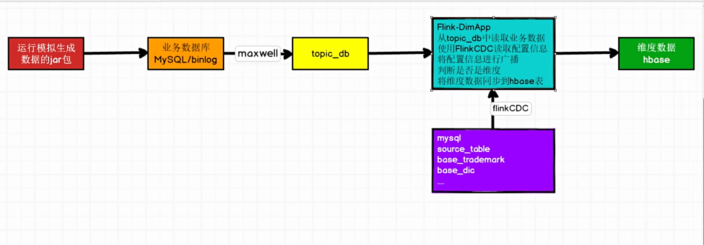

# 1.系统架构

- **数据采集：**使用 **Flume** 实时监控日志文件并将其推送到 **Kafka** 集群。这是非常标准的“日志解耦”做法
- **消息缓冲：** **Kafka** 作为数据总线，解耦了采集端和处理端，起到削峰填谷的作用，划分了 **ODS**（原始数据层）和 **DWD**（明细数据层）
- **实时计算：** **Flink** 是核心引擎，负责数据清洗、转换（ETL）以及将流式数据与维度数据进行关联，采用“**旁路缓存**”模式。Flink 在处理实时流时，优先查询 **Redis**（热数据缓存），如果缓存未命中则查询 **HBase**（全量维度存储）
- **数据存储与应用：** **Doris (StarRocks)**作为最终的 OLAP 引擎，存储查询宽表（DWS/ADS 层）。其强大的聚合和并行查询能力支撑了前端的报表和即席查询

# 2. DIM

##### 1. 选哪个数据库

- 选 **Key-Value（KV）类型**的数据库， 而非传统关系型数据库（MySQL/PostgreSQL），因为要根据主键查询，连接事实表和维度表。另外KV 数据库的查询通常是基于 Key 的直接定位，在算法复杂度上趋近于 $O(1)
- **Key-Value（KV）类型**的数据库有：Redis、HBase
- 为什么不用Redis：如果维度表非常巨大（例如用户表有数亿甚至**数十亿行**，包含大量画像标签），内存数据库 Redis 成本太高，无法将 所有数据放进内存
- **HBase** 作为基于磁盘（HDFS）的 KV 存储，利用 LSM-Tree 结构，既能存储 **PB 级**的海量数据，又能提供稳定的随机读性能

##### 2. 如何知道数据是维度表数据

- 在程序中用一个列表储存所有维度表的表名，可以实现，但不灵活，后期不便于更改
- 在配置文件中用一个列表储存所有维度表的表名，不适合分布式系统
- Redis：用一张表储存维度表信息；存在flink连接redis频繁以及redis最终一致性问题
- **Flink CDC:** 立刻捕获维度表状态的变化，将维度表广播到所有flink并行度

##### 3. 实时数仓维度数据同步架构实现原理

- **Maxwell** 实时监听 MySQL 的 **binlog**，将业务数据和维度表名称同步到Kafka不同的主题
- **Flink** 从配置 Topic 读取信息并进行“广播”， 当 MySQL 中的维表配置发生变化时，Flink 作业无需重启即可动态感知； 从 topic_db **读取业务数据**，根据广播出来的配置信息，判断当前数据是否属于目标维度表
- 经过过滤和转换后的维度数据，实时写入 **HBase**。HBase 因其**高并发查询**和**海量存储**能力，常在实时数仓中充当**维度表（DIM 层）**的存储介质，方便后续在 **DWD 层流表关联**（Lookup Join）时使用
- **缺点：** 数据采集端需要维护maxwell这个额外组件，所以一个新方案是使用 **Flink CDC** 捕获变化数据

##### 4. 数据同步架构从**Maxwell + Kafka** 切换为 **Flink CDC**

- **简化架构：**去除Maxwell 和对应的 Kafka Topic，使用 Flink CDC 直接与 MySQL 通信，减少了链路中的故障点和Kafka 的存储开销
- **全量与增量的一体化同步：** 之前可能需要手动触发一次业务库查询，现在 Flink CDC 启动时会**自动扫描配置表存量**数据，完成后自动切入 Binlog 监听，确保配置信息始终完整
- **端到端一致性：** Flink CDC 的 Offset 信息直接存储在 Flink 的 Checkpoint 中

##### 5. Flink CDC

